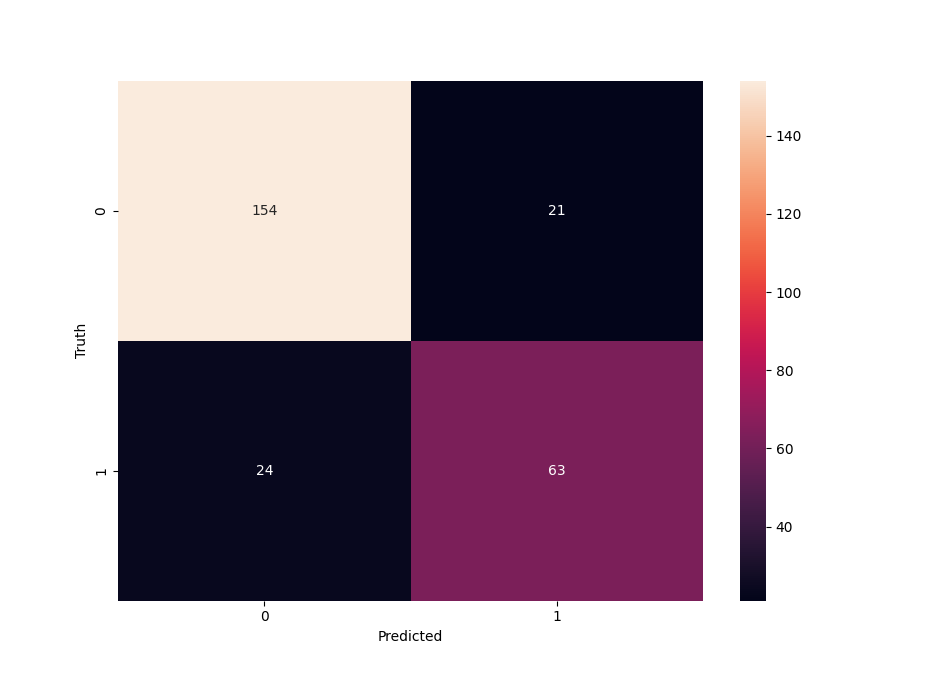

# titanic-survival-prediction
Using passenger list from Titanic, creates model to predict survival using Scikit-learn.

### NOV2022

## The Dataset

#### The passenger list from the Titanic was downloaded from the link below. This dataset contains the information of 1309 passengers including their glass, age, gender, and whether they survived. This dataset was used to train a model to predict whether a passenger would survive on the Titanic based on their information.

https://raw.githubusercontent.com/tpradeep8/tableau-data-visualization/master/titanic%20passenger%20list.csv

## Classification using Scikit-learn

#### The following blog was used to train the model using Sklearn:

https://www.analyticsvidhya.com/blog/2021/07/titanic-survival-prediction-using-machine-learning/

 #### The dataset was downloaded from the link above and saved locally on my computer as a .csv. Once the file was opened in Python, the following changes had to be made.
 * There were multiple columns in the data that would not be useful in training the model, such as the destination of the passenger, their cabin, their ticket number, their name, etc. These columns were discarded.
 * Some values were missing in the age, fare, and embarked columns. Rather than remove the entire datapoint, the mean of that feature was used.
 * The data was split into two variables, one variable to hold the information on who survived (the label), and one variable to hold the rest of the information (the features).
 * Lastly, the data had to be separated into training and testing data. 20% of the data was split to be used for testing.

 #### The model used was logistic regression which is a linear model. After training, the model showed an accuracy of approximately 82%.

 ## Checking Accuracy

#### In order to validate the model, the training set was inputted into the model. The outputs of the model were compared to the actual values through a confusion matrix. 

